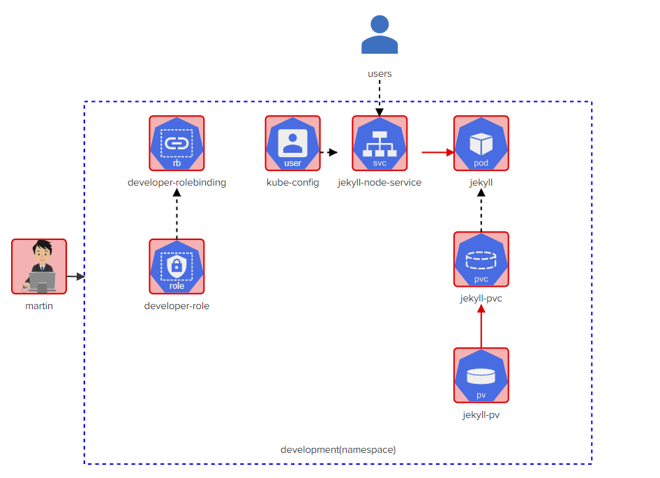

# Kubernetes-Challenge1-from-kodekloud

# 1- martin
## Task 1.1: Build User Information for Martin in kubeconfig

### User Information for Martin
- User: martin
- Client Key: /root/martin.key
- Client Certificate: /root/martin.crt

Note: Make sure not to embed the client key and certificate within the kubeconfig file.

## Task 1.2: Create a New Context called 'developer'

### New Context 'developer'
- User: martin
- Cluster: kubernetes

# 2- developer-role
## Task 2.1: the required permissions for the 'developer-role' in the 'development' namespace of our Kubernetes cluster. 
- 'developer-role', should have all(*) permissions for services in development namespace

- 'developer-role', should have all permissions(*) for persistentvolumeclaims in development namespace

- 'developer-role', should have all(*) permissions for pods in development namespace

# 3- developer-rolebinding
## Task 3.1:
- create rolebinding = developer-rolebinding, role= 'developer-role', namespace = development

- rolebinding = developer-rolebinding associated with user = 'martin'

# 4- kube-config
## Task 4.1:
- set context 'developer' with user = 'martin' and cluster = 'kubernetes' as the current context.

# 5- jekyll-node-service
## Task 5.1:

- Service 'jekyll' uses targetPort: '4000', namespace: 'development'

- Service 'jekyll' uses Port: '8080', namespace: 'development'

- Service 'jekyll' uses NodePort: '30097', namespace: 'development'
- Service 'jekyll' uses selector: 'run=jekyll' (for pod: jekyll) , namespace: 'development'
  
# 6- jekyll-node-service
## Task 6.1:

- Storage Request: 1Gi

- Access modes: ReadWriteMany

- pvc name = jekyll-site, namespace = development

- 'jekyll-site' PVC should be bound to the PersistentVolume called 'jekyll-site'.

# 7- jekyll-pod
## Task 7:

### InitContainer: 'copy-jekyll-site'
- Name: 'copy-jekyll-site'
- Image: 'kodekloud/jekyll'
- Command: `["jekyll", "new", "/site"]` (Command to run: `jekyll new /site`)
- Mount Path: `/site`
- Volume Name: 'site'

### Container: 'jekyll'
- Name: 'jekyll'
- Image: 'kodekloud/jekyll-serve'
- Volume Name: 'site'
- Mount Path: `/site`
- Uses Volume called 'site' with PVC: 'jekyll-site'

### Labels
- Label: `run=jekyll`
